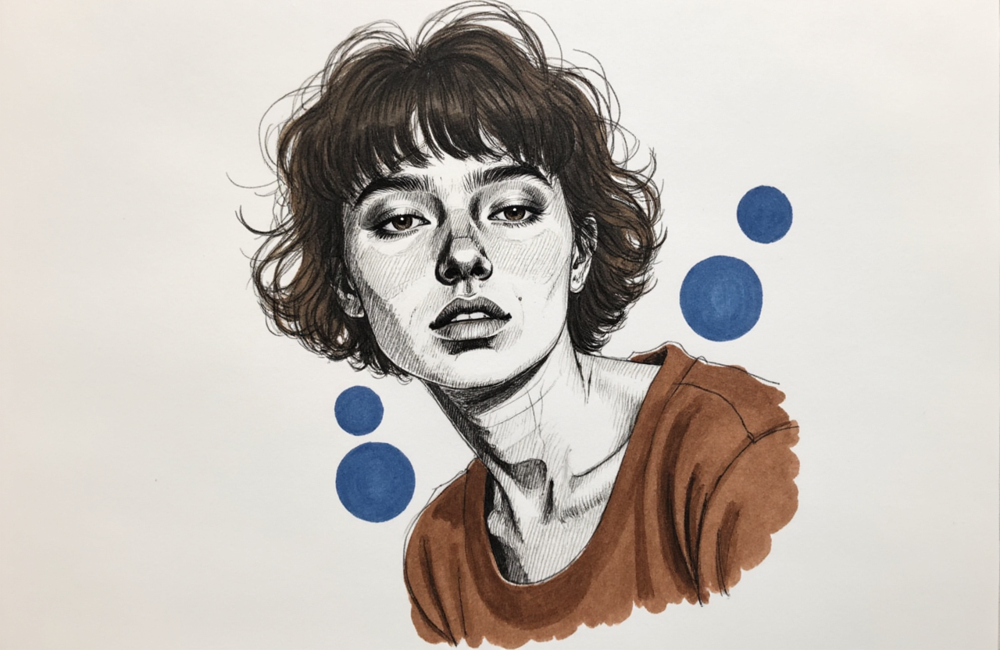
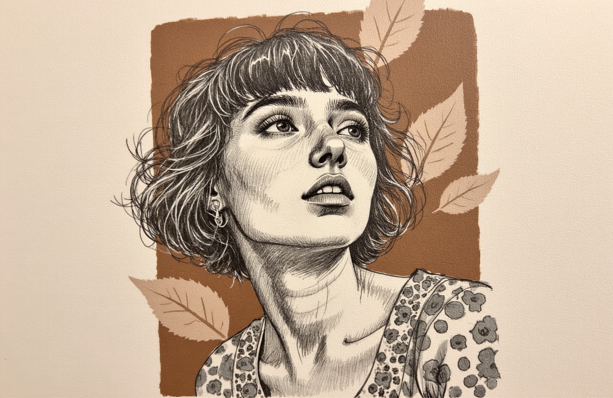
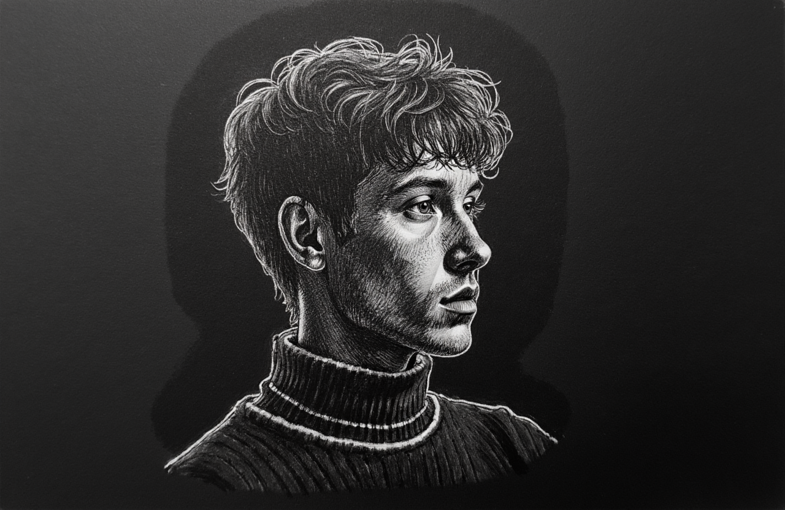

Check out the configuration reference at https://huggingface.co/docs/hub/spaces-config-reference

# Model description for Flux-Sketch-Smudge-LoRA 


# Sketch Smudge Gallery 🎨

Explore a collection of artistic sketches, each crafted to convey unique styles and emotions. From whimsical illustrations to dramatic charcoal sketches, this gallery showcases diverse creative expressions.

---

## Sketches and Descriptions

### 1. Elegant Woman with Knitted Cap
  
*Gray and white drawing of a woman's head on a vibrant red background. She wears a gray knitted cap and a white scarf, with cascading hair framing her face.*

---

### 2. Woman in a Brown Jacket
  
*Medium-sized sketch of a woman with long, wavy hair wearing a brown jacket. Blue circles decorate the background of the sketch.*

---

### 3. Vibrant Red-Haired Woman
  
*Sketch of a woman with red hair tied in a ponytail, blue-tinted eyes, and lips. She wears a white dress and scarf, drawn in a simple, hand-drawn style.*

---

### 4. Black and White Ink Sketch
  
*A black and white sketch of a woman’s face with a red circle around it. The background is cream-colored with subtle shadows adding depth.*

---

### 5. Naturalistic Floral Portrait
  
*Detailed sketch of a woman gazing upward, with wavy hair blending into an earthy brown background. She wears a blouse adorned with floral patterns.*

---

### 6. Intense Charcoal Portrait
  
*Charcoal sketch of a man with furrowed eyebrows and a leather jacket. The dramatic background enhances the gritty atmosphere.*

---

### 7. Whimsical Girl with Braids
  
*A playful sketch of a young girl with wide eyes, laughing joyfully. Her polka-dotted dress and bright bows add to the cheerful tone.*

---

### 8. Dramatic Side Profile in Charcoal
  
*Charcoal sketch of a man's illuminated side profile on black paper. The sharp contrast of light and shadow creates a moody atmosphere.*

---

### 9. Minimalist Emoji
  
*Sketch of a yellow hugging face emoji with big hands. The minimalist design uses negative space on a flat beige background.*

# Image Processing Parameters 

| Parameter                 | Value  | Parameter                 | Value  |
|---------------------------|--------|---------------------------|--------|
| LR Scheduler              | constant | Noise Offset              | 0.03   |
| Optimizer                 | AdamW  | Multires Noise Discount   | 0.1    |
| Network Dim               | 64     | Multires Noise Iterations | 10     |
| Network Alpha             | 32     | Repeat & Steps           | 22 & 3290 |
| Epoch                     | 18   | Save Every N Epochs       | 1     |

    Labeling: florence2-en(natural language & English)
    
    Total Images Used for Training : 26 [ 14 bit raw ]

## Best Dimensions & Inference

| **Dimensions** | **Aspect Ratio** | **Recommendation**       |
|-----------------|------------------|---------------------------|
| 1280 x 832      | 3:2              | Best                     |
| 1024 x 1024     | 1:1              | Default                  |

### Inference Range

- **Recommended Inference Steps:** 30–35

## Setting Up
```python
import torch
from pipelines import DiffusionPipeline

base_model = "black-forest-labs/FLUX.1-dev"
pipe = DiffusionPipeline.from_pretrained(base_model, torch_dtype=torch.bfloat16)

lora_repo = "strangerzonehf/Flux-Sketch-Smudge-LoRA"
trigger_word = "Sketch Smudge"  
pipe.load_lora_weights(lora_repo)

device = torch.device("cuda")
pipe.to(device)
```
## Trigger words

You should use `Sketch Smudge` to trigger the image generation.

## Download model

Weights for this model are available in Safetensors format.

[Download]([/strangerzonehf/Flux-Sketch-Smudge-LoRA/tree/main](https://huggingface.co/strangerzonehf/Flux-Sketch-Smudge-LoRA)) them in the Files & versions tab.

